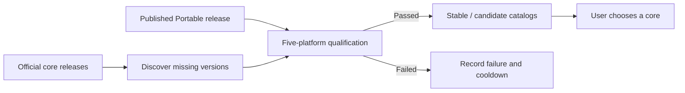

# Independent product and core updates

产品和内核使用独立发布线；稳定/候选是各发布线的通道选择。官方新版由 Actions
自动发现、验证并补入列表，用户自行选择安装。每个版本都要测试，但并非每个版本
都要手工适配：公开接口保持兼容时复用同一实现，只有测试证实接口变化时才修改
适配层。官方补齐的功能按能力检测退出补充实现，避免长期维护重复界面。

Portable owns the desktop shell, runtime packaging, update transaction, user-data
preservation and diagnostics. Official DSH owns the chat workspace and core
behavior. Publishing an official core must not create a Portable release.

## Automatic intake

1. Use the published stable Portable release and its successful product build as
   the shell baseline. A successful but unpublished main commit is not a client
   compatibility baseline.
2. Discover official registry versions, not only moving dist-tags. Keep registry
   integrity and immutable upstream source provenance for each selected version.
   Derive publishable members from the official release planner in that exact
   checkout, including its private-package exclusions; never count directories
   or maintain per-version package-count exceptions.
3. Qualify one missing version per channel run, newest first, then backfill the
   retained supported window. Record failed attempts with a cooldown so a broken
   newest version does not prevent an older missing version from being tested.
   A corrected intake-pipeline revision retries failed versions immediately;
   already qualified versions do not need rebuilding for a pipeline-only change.
4. Run the existing five-platform installation, startup, plugin preservation and
   rollback gates. Publish only successful component archives and catalogs.
   During staging, bind our bundled market's settings peer to the exact official
   host under test. npm otherwise excludes newly numbered prereleases from the
   old enumerated peer range. This changes only our package metadata, preserves
   other dependency constraints and records the binding; runtime qualification,
   including the live market endpoint, still decides whether it may publish.
5. Preserve the newest qualified default when adding an older version. A user
   explicitly chooses an older core; backfill must never silently downgrade it.

Discovery, qualification and installation are separate states. A version being
officially published does not prove that a particular Portable shell and its
default plugins can host it. Failed candidates leave the working installation
and accepted catalog intact.

## Compatibility work should follow interfaces

Testing every released version is automatic qualification, not manual adaptation
of every version. Reuse the same integration for versions whose public entry,
profile format and host capabilities remain compatible. Make an adapter change
only when a product check demonstrates a changed contract.

Avoid a growing list of version-specific UI forks. Prefer capability checks at
the integration boundary; keep unavoidable compatibility branches small and
covered by the actual old and new runtime behaviors. If official DSH supplies a
previously missing feature, retire the corresponding supplemental behavior after
checking data and settings compatibility. Do not disable an entire default plugin
merely because one of its features overlaps upstream.

The current manifest intentionally binds core qualification to the exact shell,
Node and runtime layout. A new Portable release therefore triggers automatic
requalification of its retained cores. This costs CI time but avoids treating an
untested shell/core pairing as compatible. A future stable host ABI could reduce
that work; removing the fingerprint check alone would not establish such an ABI.

## Reducing future build coupling

Prefer official public entry points and installable registry artifacts. Source
package layout is a packaging detail, not a compatibility API. The current
source-pack pipeline calls the upstream release-family planner. Its adapter lives
in this update repository, so a packaging-only correction does not require a new
Portable desktop release. It still depends on the upstream planner interface;
moving to verified official registry dependency closures is a separate packaging
change requiring byte/provenance, native dependency, update and rollback checks.
It should replace the existing path after qualification, rather than add another
permanent build path or delay every unrelated Portable feature release.

Neither a core intake failure nor a failed default-plugin update authorizes
rewriting official source, bypassing compatibility gates or replacing user data.
